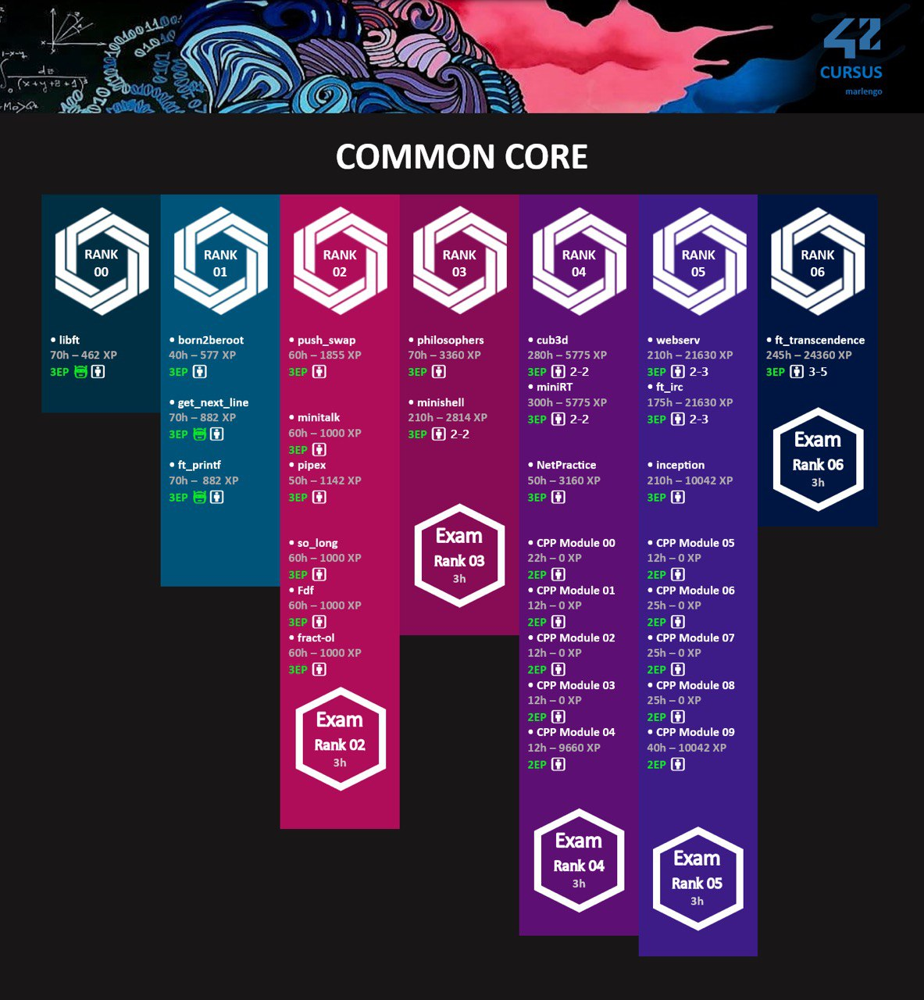

# [42 Singapore]
42 Singapore is an innovative and inclusive ICT school that offers tuition-fee free training to equip learners with the most-in-demand tech skills for jobs, accessible to all. Instead of teachers and lectures, it uses a unique peer-learning approach and offers 100% hands-on project-based learning in a gamified environment to develop technical and soft skills needed for the industry. 42 Singapore is using the pedagogy created by 42 Paris in 2013. The adoption of the pedagogy ensures that students at 42 Singapore benefit from the same teaching methods and philosophy that have made Ecole 42 successful in France and around the world.

## Projects
| RANK | PROJECT | STATUS | SUMMARY |
| ---- | ------- | ------ | ------- |
| Rank00 | [Libft] | ✅ | This project is about coding a C library.   It will contain a lot of general purpose functions your programs will rely upon.
| Rank01 | [ft_printf] | ✅ | Recode a popular and versatile function --> printf()   & learn about variadic function |
|  | [get_next_line] | ✅ | This project is about programming a function that returns a line read from a filc descriptor   & learn about static variable |
|  | [born2beroot] | ✅ | Introduction to virtualisation, System Admin related exercise   Tasked with setting up your own OS while implementing strict rules |
| Rank02 | [minitalk] | ✅ | The purpose of this project is to code a small data exchange program using UNIX signals. |
|  | [fract-ol] | |
|  | [push_swap] |   |

## Cursus
   

[//]: # 
   [42 Singapore]: <https://www.42singapore.sg>
   [Libft]: <./RANK00/Libft>
   [ft_printf]: <./RANK01/ft_printf>
   [get_next_line]: <./RANK01/get_next_line>
   [born2beroot]: <./RANK01/Born2beroot>
   [minitalk]: <./RANK02/minitalk>

