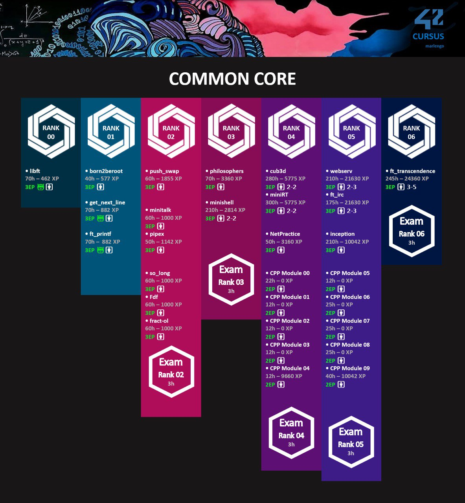

# [42 Singapore]
42 Singapore is an innovative and inclusive ICT school that offers tuition-fee free training to equip learners with the most-in-demand tech skills for jobs, accessible to all. Instead of teachers and lectures, it uses a unique peer-learning approach and offers 100% hands-on project-based learning in a gamified environment to develop technical and soft skills needed for the industry. 42 Singapore is using the pedagogy created by 42 Paris in 2013. The adoption of the pedagogy ensures that students at 42 Singapore benefit from the same teaching methods and philosophy that have made Ecole 42 successful in France and around the world.

### How to clone with submodules

1. Instead of git clone <repo>
    ```bash
    git clone --recursive -j4  git@github.com:hoobird/42cursus.git
    ```
## Projects
| RANK | PROJECT | SUBJECT | SUMMARY |
| ---- | ------- | ------- | ------- |
| Rank00 | [Libft] | [0_Libft.pdf] | This project is about coding a C library.  It will contain a lot of general purpose functions your programs will rely upon. |
| Rank01 | [ft_printf] | [1_ft_printf.pdf] | Recode a popular and versatile function --> printf()  & learn about variadic function |
| Rank01 | [get_next_line] | [1_get_next_line.pdf] | This project is about programming a function that returns a line read from a filc descriptor  & learn about static variable |
| Rank01 | [born2beroot] | [1_Born2beroot.pdf] | Introduction to virtualisation, System Admin related exercise  Tasked with setting up your own OS while implementing strict rules |
| Rank02 | [minitalk] | [2_minitalk.pdf] | The purpose of this project is to code a small data exchange program using UNIX signals. |
| Rank02 | [push_swap] | [2_push_swap.pdf] |This project will make you sort data on a stack, with a limited set of instructions, using the lowest possible number of actions. To succeed you’ll have to manipulate various types of algorithms and choose the most appropriate solution (out of many) for an optimized data sorting |
| Rank02 | [so_long] | [2_so_long.pdf] | This project is a small 2D game with graphics library minilibx. You'll learn about textures, sprites and tiles. |
| Rank03 | [Philosophers] | [3_Philosophers.pdf] | Eat, Sleep, Spaghetti, repeat. This project is about learning how threads work by precisely timing a group of philosophers on when to pick up forks and eat spaghetti without dying from hunger. |
| Rank03 | [Minishell] | [3_minishell.pdf] | The objective of this project is for you to create a simple shell that mimics Bash behaviour. |
| Rank04-05| [CPP Modules] | [00][4_CPP-Module00.pdf], [01][4_CPP-Module01.pdf], [02][4_CPP-Module02.pdf], [03][4_CPP-Module03.pdf], [04][4_CPP-Module04.pdf], [05][5_Module-05.pdf], [06][5_Module-06.pdf], [07][5_Module-07.pdf], [08][5_Module-08.pdf], [09][5_Module-09.pdf] | This project is to introduce OOP with CPP |
| Rank04 | [miniRT] | [4_miniRT.pdf] | This project is an introduction to the beautiful world of Raytracing. |
| Rank05 | [ft_irc] | [5_ft_irc.pdf] | Create your own IRC server in C++98, compatible with a standard IRC client for the required features. |
| Rank05 | [Inception] | [5_Inception.pdf] | Broaden your system administration skills by working with Docker. In this project, you'll set up a complete infrastructure using Docker Compose, creating and managing multiple containerized services including NGINX with SSL/TLS, WordPress with php-fpm, and MariaDB. You'll gain hands-on experience with containerization, networking, volume management, and secure web service deployment within your own personal virtual machine. |
| Rank06 | [ft_transcendence] | [6_ft_transcendence(new).pdf] | Design, develop, and organize a full-stack web application with complete creative freedom. Choose your project concept, select from a wide range of technical modules, and make key architectural decisions. This highly flexible project allows you to explore modern web development while demonstrating your technical skills and creativity through a modular approach. |

## Cursus
   

[//]: # (Project Repositories)
   [42 Singapore]:   <https://www.42singapore.sg>
   [Libft]:          <https://github.com/hoobird/Libft>
   [ft_printf]:      <https://github.com/hoobird/ft_printf>
   [get_next_line]:  <https://github.com/hoobird/get_next_line>
   [born2beroot]:    <https://github.com/hoobird/Born2beroot>
   [minitalk]:       <https://github.com/hoobird/minitalk>
   [push_swap]:      <https://github.com/hoobird/push_swap>
   [so_long]:        <https://github.com/hoobird/so_long>
   [Philosophers]:   <https://github.com/hoobird/Philosophers>
   [Minishell]:      <https://github.com/hoobird/Minishell>
   [miniRT]:         <https://github.com/hoobird/miniRT>
   [CPP Modules]:    <https://github.com/hoobird/CPP-Modules>
   [ft_irc]:         <https://github.com/hoobird/ft_irc>
   [Inception]:      <https://github.com/hoobird/Inception>
   [ft_transcendence]: <https://github.com/hoobird/ft_transcendence>

[//]: # (Subject PDFs)
   [0_Libft.pdf]: <https://github.com/hoobird/42CoreSubjects/blob/main/0_Libft.pdf>
   [1_Born2beroot.pdf]: <https://github.com/hoobird/42CoreSubjects/blob/main/1_Born2beroot.pdf>
   [1_ft_printf.pdf]: <https://github.com/hoobird/42CoreSubjects/blob/main/1_ft_printf.pdf>
   [1_get_next_line.pdf]: <https://github.com/hoobird/42CoreSubjects/blob/main/1_get_next_line.pdf>
   [2_minitalk.pdf]: <https://github.com/hoobird/42CoreSubjects/blob/main/2_minitalk.pdf>
   [2_push_swap.pdf]: <https://github.com/hoobird/42CoreSubjects/blob/main/2_push_swap.pdf>
   [2_so_long.pdf]: <https://github.com/hoobird/42CoreSubjects/blob/main/2_so_long.pdf>
   [3_minishell.pdf]: <https://github.com/hoobird/42CoreSubjects/blob/main/3_minishell.pdf>
   [3_Philosophers.pdf]: <https://github.com/hoobird/42CoreSubjects/blob/main/3_Philosophers.pdf>
   [4_CPP-Module00.pdf]: <https://github.com/hoobird/42CoreSubjects/blob/main/4_CPP-Module00.pdf>
   [4_CPP-Module01.pdf]: <https://github.com/hoobird/42CoreSubjects/blob/main/4_CPP-Module01.pdf>
   [4_CPP-Module02.pdf]: <https://github.com/hoobird/42CoreSubjects/blob/main/4_CPP-Module02.pdf>
   [4_CPP-Module03.pdf]: <https://github.com/hoobird/42CoreSubjects/blob/main/4_CPP-Module03.pdf>
   [4_CPP-Module04.pdf]: <https://github.com/hoobird/42CoreSubjects/blob/main/4_CPP-Module04.pdf>
   [4_miniRT.pdf]: <https://github.com/hoobird/42CoreSubjects/blob/main/4_miniRT.pdf>
   [5_ft_irc.pdf]: <https://github.com/hoobird/42CoreSubjects/blob/main/5_ft_irc.pdf>
   [5_Inception.pdf]: <https://github.com/hoobird/42CoreSubjects/blob/main/5_Inception.pdf>
   [5_Module-05.pdf]: <https://github.com/hoobird/42CoreSubjects/blob/main/5_Module-05.pdf>
   [5_Module-06.pdf]: <https://github.com/hoobird/42CoreSubjects/blob/main/5_Module-06.pdf>
   [5_Module-07.pdf]: <https://github.com/hoobird/42CoreSubjects/blob/main/5_Module-07.pdf>
   [5_Module-08.pdf]: <https://github.com/hoobird/42CoreSubjects/blob/main/5_Module-08.pdf>
   [5_Module-09.pdf]: <https://github.com/hoobird/42CoreSubjects/blob/main/5_Module-09.pdf>
   [6_ft_transcendence(new).pdf]: <https://github.com/hoobird/42CoreSubjects/blob/main/6_ft_transcendence(new).pdf>
